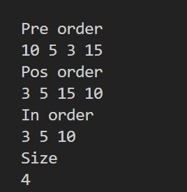
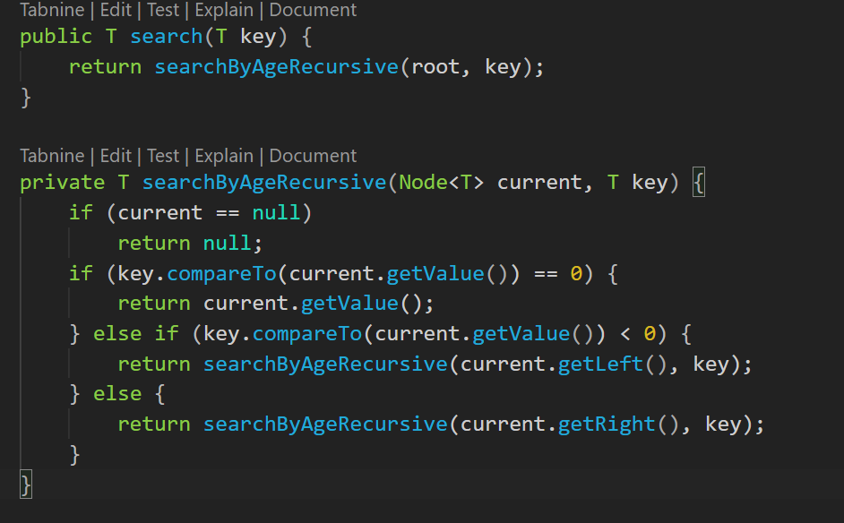
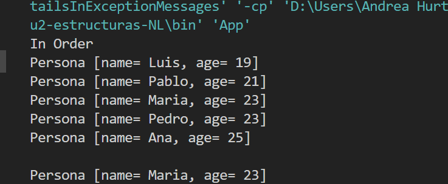
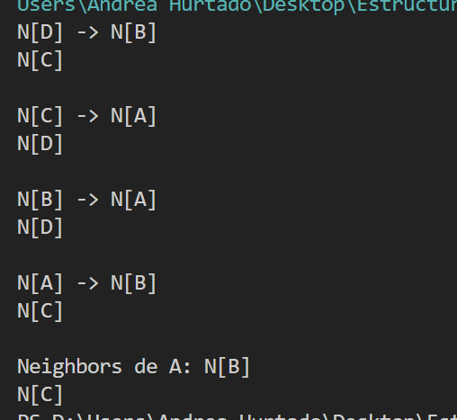
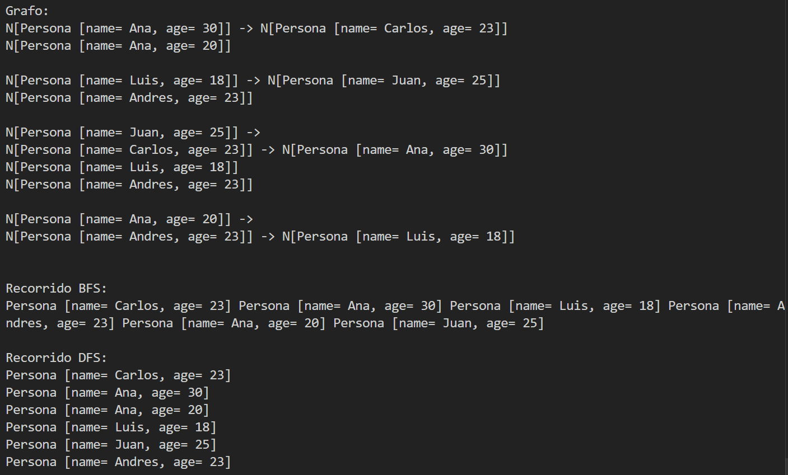

# Práctica: Estructuras No Lineales - 

## Autor
- Nombre: Andrea Hurtado
- Materia: Estructura de Datos

##  Nombre de la práctica - Fecha
- Práctica: Práctica de Árboles – Implementación Integers
- Fecha: 2025-01-05

## Descripción
Se desarrolló una estructura de datos tipo árbol binario para almacenar valores enteros. El objetivo principal fue observar cómo funcionan las operaciones básicas sobre árboles y cómo se implementan de manera recursiva.

## Evidencias

### Captura 

- Archivo 1: 

- Archivo 2:

- Archivo 3:
Metodo search genérico: Busca un valor en el árbol usando la comparación de T, definida por compareTo. Compara el valor que quieres encontrar con el del nodo, si es igual, lo devuelve. Si es menor, baja por la izquierda. Si es mayor, baja por la derecha. Si llega a un nodo vacío, no existe.

- Archivo 4: 

- Archivo 5:
Utilizamos grafos para saber las conexiones de un nodo desde con una complejidad O(1) para que directamente busque la clave del nodo y diga cuales son las conexiones

- Archivo 6: 

- Archivo 7: Utilizamos un bfs busca por anchura,encontrar la ruta más corta entre dos nodos y luego va al siguiente nodo y un dfs recursivo parar recorrer un grafo yendo lo más profundo posible.

